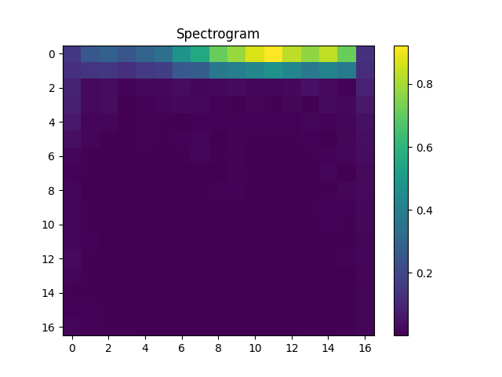
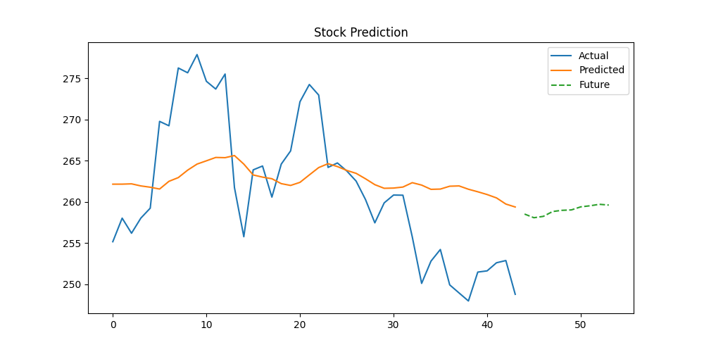

# 📊 Financial Time Series Forecasting using CNN & STFT

## 🔹 Author
**Name:** Aakash P D

**University Register Number:** TCR24CS001
## 🔹 Project Overview
This project predicts **future stock prices** using **financial time series data**.  
It combines **time-frequency signal processing** (Short-Time Fourier Transform) and **Convolutional Neural Networks (CNN)** for prediction.

We use multiple financial features as input:
- Stock price vs time  
- Revenue vs quarter  
- Profit vs quarter  
- Market index (Sensex) vs time  
- USD–INR exchange rate vs time  

The multivariate signal is transformed into a **time-frequency representation (spectrogram)**, which is then fed into a CNN for forecasting.

---

## 🔹 System Pipeline

```text
📈 Time Series Data  →  🔊 STFT  →  🖼️ Spectrogram  →  🤖 CNN  →  💰 Predicted Stock Price
```
- Time Series Data: Collected from Yahoo Finance, NSE, BSE, RBI, or Kaggle
- STFT (Short-Time Fourier Transform): Converts signal into spectrogram
- CNN: Learns patterns in spectrograms for regression (predicting future price)

---

## 🔹 Features
Multi-feature financial input
Time-frequency analysis with STFT
CNN-based regression for forecasting
Visualization of spectrograms and predictions

---
## 🔹 Project Structure
```text
financial-cnn-forecast/
├── financial_cnn_forecasting.ipynb     # Main notebook with code & outputs
├── financial_cnn_forecasting.py        # Optional clean Python code
├── outputs/                            # Folder with generated images
│   ├── prediction.png
│   ├── spectrogram.png
├── README.md                            # This file
├── requirements.txt                     # Python dependencies
```
---
## 🔹 Spectrogram (Time-Frequency Representation)

The spectrogram is a **2D time-frequency representation** of the financial signal.

- **Horizontal axis:** Time  
- **Vertical axis:** Frequency  
- **Intensity (color):** Signal energy  

**Interpretation:**

- **Low-frequency components:** Represent long-term trends  
- **High-frequency components:** Represent short-term fluctuations  

**Example:**  

  

---
## 🔹 Predicted Stock Prices

This plot shows the comparison between **predicted** and **actual** stock prices.

- **Comparison:** Predicted vs actual stock prices  
- **Evaluation:** Model performance is measured using **Mean Squared Error (MSE)**  
- **Interpretation:** Shows how effectively the CNN model learned patterns from the spectrogram  

**Example:**  



---

## 🔹 How to Run

1. **Clone the repository:**

```bash
git clone https://github.com/yourusername/financial-cnn-forecast.git
cd financial-cnn-forecast
```
2. **Install dependencies:**
```bash
pip install -r requirements.txt
```
3. **Open the notebook in Google Colab or Jupyter:**
```bash 
jupyter notebook financial_cnn_forecasting.ipynb
```
4. **Run all cells** → Outputs (images, predictions) will be generated in the outputs/ folder.

5. 🔹 Data Sources

The financial time series data can be collected from:

Yahoo Finance: https://finance.yahoo.com
NSE India: https://www.nseindia.com
BSE India: https://www.bseindia.com
RBI Database: https://www.rbi.org.in
Kaggle: https://www.kaggle.com
🔹 References
Y. Zhang and C. Aggarwal, “Stock Market Prediction Using Deep Learning,” IEEE Access
A. Tsantekidis et al., “Deep Learning for Financial Time Series Forecasting”
S. Hochreiter and J. Schmidhuber, “Long Short-Term Memory,” Neural Computation, 1997
A. Borovykh et al., “Conditional Time Series Forecasting with CNNs”
🔹 Expected Outcome
Financial time series can be analyzed as signals
Spectrograms reveal hidden patterns in stock price data
CNN models can learn useful representations from spectrograms to predict future stock prices
Generated images:
outputs/spectrogram.png → shows time-frequency representation
outputs/prediction.png → shows predicted vs actual stock prices
